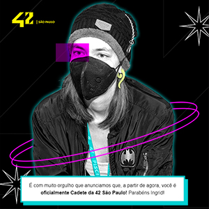

# 42

A **42** é uma escola francesa de programação que utiliza o *"peer-to-peer"* como método de aprendizado e oferece uma formação gratuita em Engenharia de Software. Não existem aulas ou professores, os participantes aprendem uns com os outros. Além de toda a parte técnica que é desenvolvida gradativamente desde os conceitos mais básicos, a instituição incentiva o desenvolvimento de *soft skills* como trabalho em equipe, comunicação e pensamento analítico. As próprias avaliações também são realizadas entre os estudantes, momento no qual compartilham seus conhecimentos e aprendem a dar feedback aos seus pares.

## Níveis

### Piscina

- [x] Piscina
- [x] WarmUp

### HumanCoder

- [ ] FASE 1: Entrando em Órbita
- [ ] FASE 2: Ampliando Horizontes
- [ ] FASE 3: Explorando o Espaço

### Especializações

- [ ] Design Gráfico
- [ ] Desenvolvimento de Jogos
- [ ] Desenvolvimento de Software
- [ ] Segurança Cibernética
- [ ] Ciência de Dados
- [ ] Intelig
